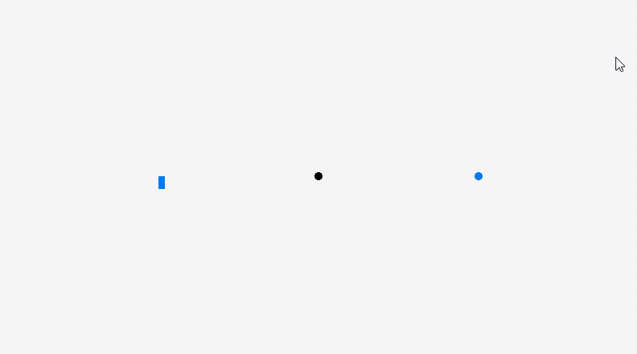

# 2D_Hitscan

A hitscan is a tool often used in video games, to detect collisions between any character that a player might control, and a target that the player might aim at.

This short code written in C demonstrates a working example of a hitscan.

## Dependecies

The code is written on top of the (https://github.com/raysan5/raylib/)[raylib library]. The raylib library is a small lightweight library written entirely in C to help encourage video game programming.
Instructions on how to compile raylib can be found on the [raylib wiki](https://github.com/raysan5/raylib/wiki).

## Licence

This code is licensed under the MIT Lincense.

*GIF demonstrating a hitscan. The player in black, detects and hence changes the colour of the rectangular and circular target*

